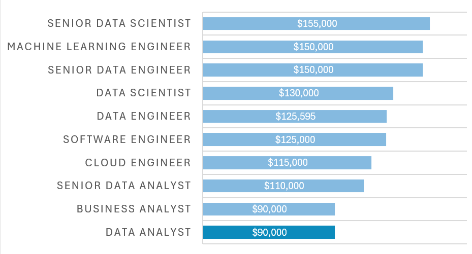
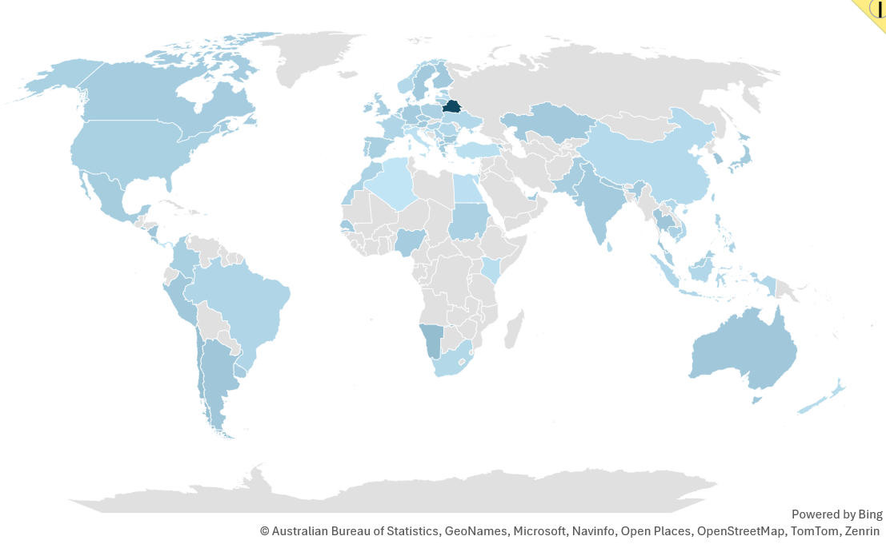
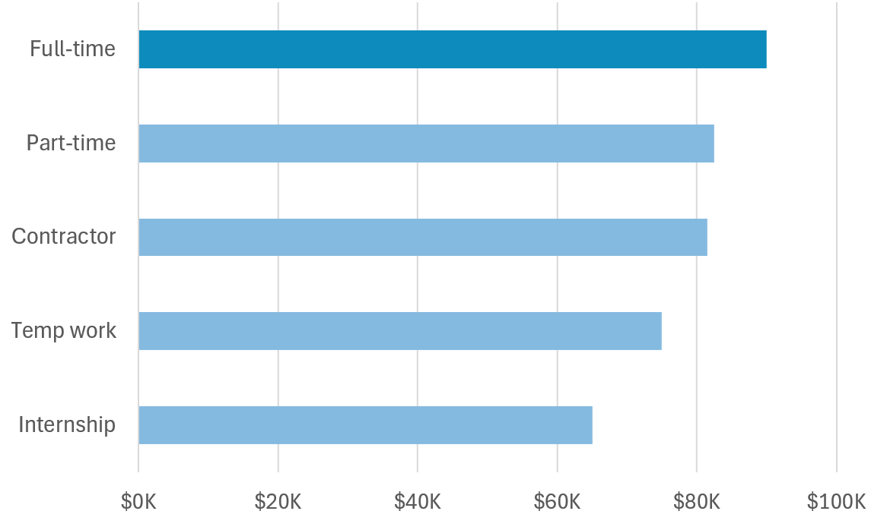
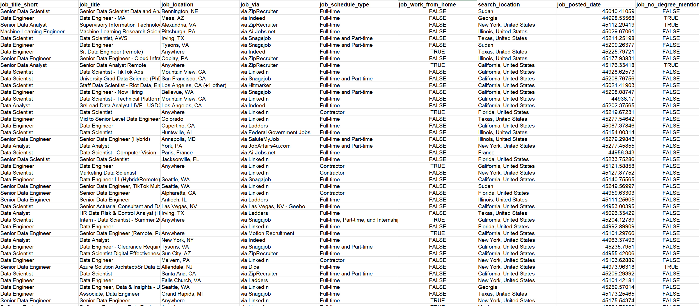

# Data Job Salary Dashboard

An interactive Excel dashboard designed to analyze global IT and data-related job salaries by country, job title, and employment type.


**Link to the dashboard**: **[Data_Job_Salary_Dashboard.xlsx](Data_Job_Salary_Dashboard.xlsx)**.
## 1. Summary

This project focuses on building an interactive salary analysis dashboard using Microsoft Excel.  
The dashboard allows users to explore salary distributions across different job titles, countries, and employment types through dynamic filtering and visualization.
The project was developed using a real-world dataset containing over 32,000 job postings related to IT and data careers.

The dashboard dynamically updates:
- Median salary
- Top job posting platform
- Total job count
- Salary comparison charts

- Geographic job distribution

- Employment Type


## Excel Features Used

The following Excel functionalities were applied throughout the project:

- Functions and formulas
- Dynamic arrays
- Data validation
- Slicers and dropdown filtering
- Data Visualization (Bar charts, Map charts, KPI cards)
- Collaboration & Protection

## Key Functionalities

Users can interactively filter the dashboard by:
- Job Title
- Country
- Employment Type

# 2. Dataset

The project uses a real-world dataset containing **32,673 job postings** and **15 attributes** related to IT and data careers.

The dataset includes information such as:
- Job title
- Salary
- Country
- Job location
- Employment type
- Job posting platform
- Posting date
- Skills and technologies




The dataset covers multiple technical roles, including:
- Data Analyst
- Data Scientist
- Data Engineer
- Machine Learning Engineer
- Software Engineer
- Cloud Engineer
- Business Analyst

## Dataset Purpose

The dataset was used to:
- Analyze salary trends
- Compare compensation across countries
- Identify differences between employment types
- Explore hiring patterns within the technology industry


# 3. Build Dashboard
## 3.1 Data Preparation & Cleaning
### Extraction of Unique Categorical Values

To support the dashboard’s interactive filtering system, the `UNIQUE()` function was applied to the original dataset to generate distinct categorical lists for:

- Job titles
- Countries
- Employment types

These lists were subsequently used to populate dynamic dropdown selectors within the dashboard.

---

### Compound String Filtering

The `job schedule type` column frequently contained compound employment labels such as:

```text
Full-time and Part-time
```

To improve dashboard usability and maintain consistent filtering behavior, compound entries were removed using a combination of:

- `SEARCH()`
- `ISNUMBER()`
- `FILTER()`
- `NOT()`

This logic excluded multi-value strings and retained only singular employment categories such as:

- Full-time
- Part-time
- Contractor
- Internship

Example implementation:

```excel
=FILTER(
 J2#,
 (NOT(ISNUMBER(SEARCH("and",J2#)))+
 ISNUMBER(SEARCH(", ",J2#)))*
 (J2#<>0)
)
```

---

### Text Normalization

The `SUBSTITUTE()` function was utilized to standardize platform labels by removing unnecessary text prefixes.

For example:

```text
via LinkedIn → LinkedIn
```

This normalization process improved the readability of dashboard KPI cards and ensured cleaner categorical presentation.

---

### Handling Null and Zero Values

Rows containing missing or zero salary values were identified and excluded during the preparation stage to avoid distortion in salary-related calculations.

This preprocessing step ensured:
- Greater statistical reliability
- More accurate median salary calculations
- Improved analytical consistency across dashboard outputs


## Backend Logic and Formula Calculations

The backend architecture of the dashboard was designed using dynamic array formulas, Boolean logic, and lookup functions to synchronize user interactions with real-time analytical outputs.

The calculation framework connects dashboard controls directly to the underlying dataset, allowing all visualizations and KPI metrics to update dynamically based on user selections.

---

### Interface Synchronization via Data Validation

Cleaned categorical lists generated during the data preparation phase were connected to dashboard input cells using Excel’s Data Validation feature.

This implementation restricted user selections to predefined categories and ensured consistency across dashboard interactions.

Data validation controls were applied to:
- Job Title
- Country
- Employment Type

This approach improved:
- Input accuracy
- Formula stability
- Dashboard usability
- Error prevention

---

### Implementation of Named Ranges

Critical dashboard input cells were assigned custom named ranges such as:

```text
title
country
type
```

Instead of relying on static cell references (e.g., `C4` or `G4`), named ranges were integrated directly into formulas to improve:

- Formula readability
- Maintainability
- Logical structure
- Scalability of calculations

This design approach created more interpretable and academically structured formulas throughout the backend calculation layer.

---

## 3.2 Boolean Logic and Array Multiplication

To dynamically filter the dataset across multiple concurrent conditions, the backend utilizes Boolean array multiplication.

The filtering logic simultaneously evaluates:
- Job Title
- Country
- Employment Type

Example logic structure:

```excel
(Criteria_1) * (Criteria_2) * (Criteria_3)
```

Within Excel:
- `TRUE` evaluates to `1`
- `FALSE` evaluates to `0`

By multiplying these arrays together, only rows satisfying all conditions return a value of `1`, effectively isolating records matching the user’s dashboard selections.

This technique enables efficient multi-dimensional filtering without requiring Pivot Table dependencies.

---

### Advanced Median Computation

Since standard Excel Pivot Tables do not natively support median aggregation, a nested array-based calculation structure was implemented.

Example formula structure:

```excel
=MEDIAN(
 IF(
   (Criteria_Array),
   Return_Range
 )
)
```

This methodology allows the dashboard to dynamically compute the median salary for the filtered subset selected by the user.

The implementation ensures:
- Real-time recalculation
- Statistical robustness
- Accurate salary representation
- Dynamic analytical responsiveness

---

### Dynamic KPI Retrieval

The `XLOOKUP()` function was utilized to retrieve dynamically updated KPI outputs from backend calculation tables.

These KPI metrics include:
- Median Salary
- Job Count
- Top Job Platform

The lookup structure connects dashboard visual elements directly to calculation sheets, ensuring that displayed metrics automatically synchronize with active user filters.

This architecture improves:
- Dashboard responsiveness
- Calculation efficiency
- Real-time analytical updates

---

### Visualization Logic for Highlighting

To visually emphasize the user-selected role within the salary comparison chart, the backend generates two separate data series:

- Selected Title
- All Other Titles

These series are layered within the same horizontal bar chart and formatted using contrasting color schemes:
- Dark blue for the selected role
- Light blue for all remaining roles

This visualization logic creates a focus effect that improves:
- User attention direction
- Comparative readability
- Visual hierarchy
- Interactive analytical experience

The highlighting mechanism enhances interpretability while maintaining overall dashboard consistency.

## 3.3 Dashboard Visualizations and KPI Design

### 1. Regional Salary Distribution (Geographic Map Chart)


### 2. Comparative Job Title Analysis (Clustered Bar Chart)


### 3. Employment Type Analysis (Clustered Bar Chart)


