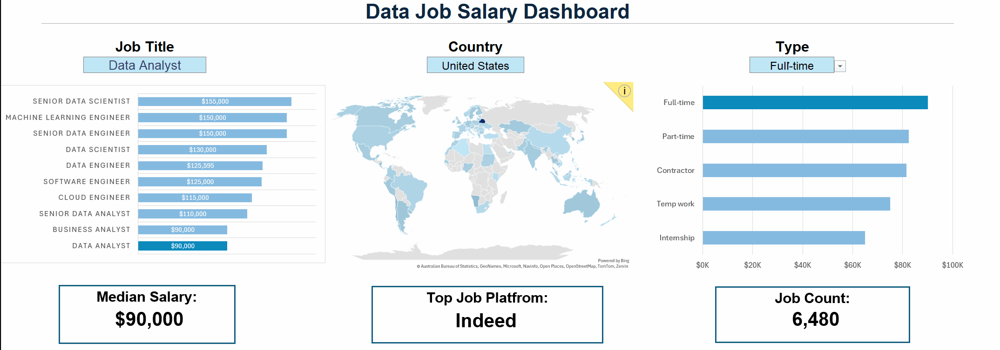

# Data Job Salary Dashboard

An interactive Excel dashboard designed to analyze global IT and data-related job salaries by country, job title, and employment type.


**Link to the dashboard**: **[Data_Job_Salary_Dashboard.xlsx](Data_Job_Salary_Dashboard.xlsx)**.
## 1. Summary

This project focuses on building an interactive salary analysis dashboard using Microsoft Excel.  
The dashboard allows users to explore salary distributions across different job titles, countries, and employment types through dynamic filtering and visualization.
The project was developed using a real-world dataset containing over 32,000 job postings related to IT and data careers.

The dashboard dynamically updates:
- Median salary
- Top job posting platform
- Total job count
- Salary comparison charts
- Geographic salary distribution

## Excel Features Used

The following Excel functionalities were applied throughout the project:

- Functions and formulas
- Dynamic arrays
- Data validation
- Slicers and dropdown filtering
- Bar charts
- Map charts
- KPI cards
- Interactive dashboard design

## Key Functionalities

Users can interactively filter the dashboard by:
- Job Title
- Country
- Employment Type

# 2. Dataset

The project uses a real-world dataset containing **32,673 job postings** and **15 attributes** related to IT and data careers.

The dataset includes information such as:
- Job title
- Salary
- Country
- Job location
- Employment type
- Job posting platform
- Posting date
- Skills and technologies

The dataset covers multiple technical roles, including:
- Data Analyst
- Data Scientist
- Data Engineer
- Machine Learning Engineer
- Software Engineer
- Cloud Engineer
- Business Analyst

## Dataset Purpose

The dataset was used to:
- Analyze salary trends
- Compare compensation across countries
- Identify differences between employment types
- Explore hiring patterns within the technology industry


# 3. Dashboard Operations
## 3.1 Salary Analysis

The dashboard calculates median salaries based on selected conditions using Excel formulas.

### Example Formula

```excel
=MEDIAN(
 IF(
   (jobs[job_title_short]=A2)*
   (jobs[job_country]=country)*
   (ISNUMBER(SEARCH(type,jobs[job_schedule_type)))*
   (jobs[salary_year_avg]<>0),
   jobs[salary_year_avg]
 )
)
```

This formula performs:
- Multi-condition filtering
- Dynamic salary aggregation
- Median salary calculation

## 3.2 Count of Job Schedule Type

```excel
=FILTER(
  J2#,
  (NOT(ISNUMBER(SEARCH("and", J2#))) +
   ISNUMBER(SEARCH(", ", J2#))) *
  (J2# <> 0)
)
```
- 🔍 **Unique List Generation:** This formula uses the `FILTER()` function to clean the data by excluding entries that contain multiple schedule types (such as those joined by "and" or commas) and by removing zero values.
- 🔢 **Formula Purpose:** The resulting list provides a set of valid job schedule types, which is then used as the basis for further analysis and counting.


# 4. Conclusion

This project demonstrates how Microsoft Excel can be used to build an interactive business intelligence dashboard using real-world job market data.

The dashboard combines:
- Data analysis
- Interactive filtering
- Dynamic calculations
- Data visualization

to transform raw datasets into clear and actionable insights.

